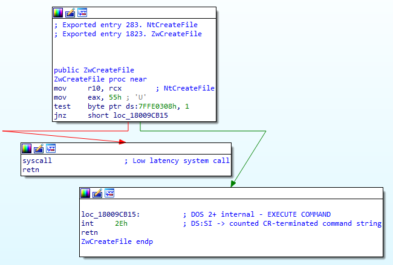

# Syscall Dumper

This is an implementation of a simple C++20 program which dumps system call information from `ntdll.dll`.

---

## 0. Introduction

The windows dynamic-link library `ntdll.dll` is the main interface through which user-mode applications access the Windows kernel. `ntdll.dll` exports functions for fundamental activities requiring access to the domain of the kernel. Examples include interacting with the filesystem, virtual memory, physical devices, and more.

These functions are are essentially thin wrappers for passing information to the kernel for execution. With each syscall, `ntdll.dll` sets up the information that the kernel needs, including placing the relevant number/operation code of the system call into register `eax`. Following this, control is diverted to the kernel using the `syscall` instruction. A more complete description of this instruction can be found [here](https://www.felixcloutier.com/x86/syscall).

The following image shows an example of the disassembly of an `ntdll.dll` system call export:



`ntdll.dll` itself exports over 2000 functions. On Windows 1909, 464 of these are these system call wrappers. The exports of a given executable can quickly be dumped using `dumpbin.exe` as follows:

```
C:\>dumpbin /exports C:\Windows\System32\ntdll.dll
Microsoft (R) COFF/PE Dumper Version 14.24.28316.0
Copyright (C) Microsoft Corporation.  All rights reserved.

Dump of file C:\Windows\System32\ntdll.dll

File Type: DLL
  Section contains the following exports for ntdll.dll
    00000000 characteristics
     C1BB301 time date stamp
        0.00 version
           8 ordinal base
        2381 number of functions
        2380 number of names

    ordinal hint RVA      name
          9    0 00040230 A_SHAFinal
         10    1 00041060 A_SHAInit
        ...    (truncated)
```

`ntdll.dll` is not intended to be accessed directly by user code. Instead, other libraries and subsystem APIs (such as `kernel32.dll`) leverage `ntdll.dll` and provide an abstraction layer. However, there are certain situations (often times when creating malware) that requires direct or indirect invocation of system calls.

## 1. Extracting System Call Numbers on x86_64

Whatever the reason, it is fairly simple process to get system call numbers from `ntdll.dll`. This involves looping through its export address table and picking out functions with `Nt` or `Zw` in the name. From there, pattern matching can be performed to check whether the function is actually a system call and extract the system call number from the code bytes.


## 2. SyscallDumper

This repository demonstrates dumping system call numbers from `ntdll.dll`. It should be noted that other Windows libraries expose system calls, but those are not covered here.

### Use:

```
C:\>SyscallDumper.exe
ordinal   RVA       code      name

190       9c0a0     2         NtAcceptConnectPort
191       9c060     0         NtAccessCheck
192       9c580     29        NtAccessCheckAndAuditAlarm
... (truncated)
653       9cb40     57        NtWriteRequestData
654       9c7a0     3a        NtWriteVirtualMemory
655       9c920     46        NtYieldExecution
```

## 2. Conclusion


## References
- [J00ru's System Call Tables](https://j00ru.vexillium.org/syscalls/nt/64/)
